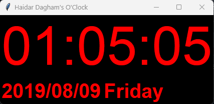

# Haidar Dagham's Clock Program 🕒

A sleek, real-time **digital clock** built using Python and Tkinter. This desktop application displays the current time, date, and day of the week, updating every second.

## 🖥 Features

- Real-time digital clock with automatic updates  
- Displays:
  - Current Time (`HH:MM:SS`)
  - Current Date (`YYYY/MM/DD`)
  - Current Day of the Week (`e.g., Monday`)
- Clean and minimal GUI with customizable styling  
- Fully packaged `.exe` version for Windows using PyInstaller

---

## 📸 Screenshots

<p align="center">
  <strong>'Clock Program' Desktop View</strong><br>
  
</p>

---

## 🚀 Running the Application

### 🔧 From Source (Python Script)

Make sure Python is installed, then run:

```bash
python clock_program.py
```

### 📦 As Executable (Windows .exe)

If you've downloaded the `.exe` version:

Just double-click on `clock_program.exe` to start the clock.  
No need to install Python.

---

## 🛠 How It Was Built

- **Language:** Python 3  
- **GUI:** Tkinter  
- **Time Functions:** Python's built-in `time` module  
- **Packaging:** PyInstaller

### 🛠 To generate the `.exe` file yourself:

Place the `icon.ico` image and the `clock_program.py` file in the same folder,
then open Terminal in that folder, and run:

```bash
pyinstaller -F -w -i icon.ico clock_program.py
```

---

## 📁 Files Included

- `clock_program.py` – The main Python script  
- `clock_program.exe` – The compiled Windows executable  
- `icon.ico` – Icon image for the game window  
- `README.md` – This file

---

## 👨‍💻 Author

**Haidar Dagham**
